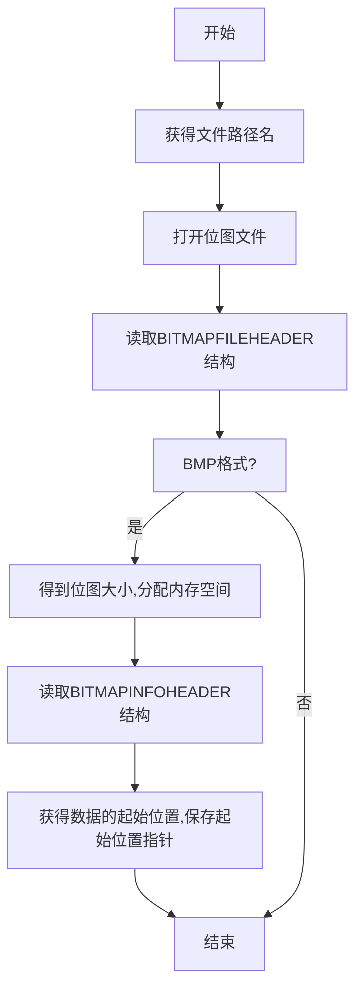
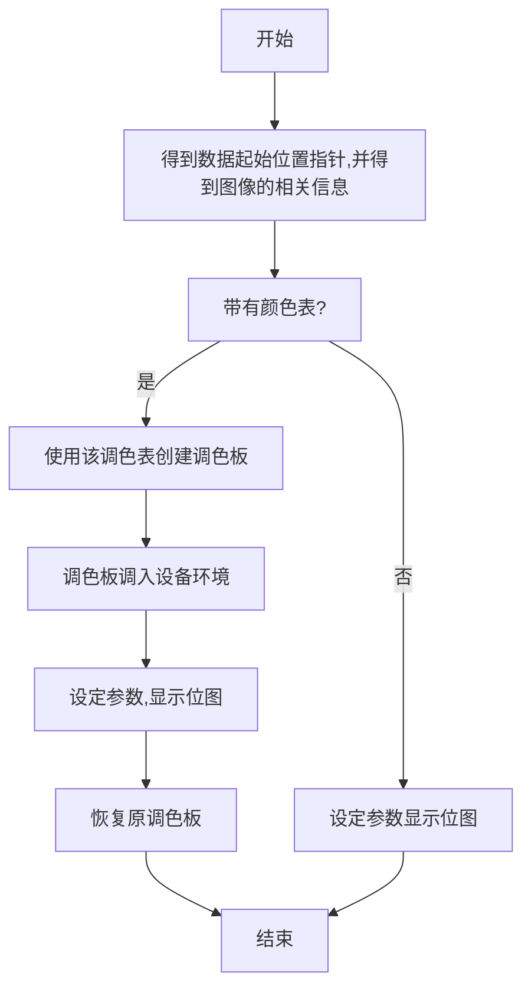

# BMP（位图）

[TOC]

## 0 - BMP文件头（BITMAP<u>FILE</u>HEADER）

```cpp
typedef struct tagBITMAPFILEHEADER {
    WORD bfType; // = BM
    DWORD bfSize; // File Size
    WORD bfReserved1; // = 0
    WORD bfReserved2; // = 0
    DWORD bfOffBites; // Start point of bitmap data
} BITMAPFILEHEADER;
```

> 共14个字节。
>
> 读取到首字节为“BM”，判断该文件是位图文件。

## 1 - 位图信息头（BITMAP<u>INFO</u>HEADER）

```cpp
typedef struct tagBITMAPINFOHEADER {
    DWORD biSize;
    LONG biWidth; // Measured with "pixel"
    LONG biHeight; // Measured with "pixel"
    WORD biPlanes; // default = 1
    WORD biBitCount; // Bits for each pixel
    DWORD biCompression; // Compression Type( = 0)
    DWORD biSizeImage; // Bitmap Size
    LONG biXPelsPerMeter;
    LONG biYPelsPerMeter;
    DWORD biClrUsed; // Number of used colors
    DWORD biCLrImpotant; // Number of used IMPORTANT colors
} BITMAPINFOHEADER;
```

> 共40个字节。

## 2 - 颜色表（RGBQUAD）

```cpp
typedef struct tagRGBQUAD {
	BYTE rgbBlue; // blue color
    BYTE rgbGreen; // green color
    BYTE rgb Red; // red color
    BYTE rgbReserved; // = 0
} RGBQUAD;
```

> 共4个字节。

## 3 - 位图数据

```cpp
typedef struct tagBITMAPINFO {
	BITMAPINFOHEADER bmiHeader;
    RGBQUAD bmiColors[1]; // color table
} BITMAPINFO;
```

## 4 - 文件打开流程



## 5 - 图像显示流程



