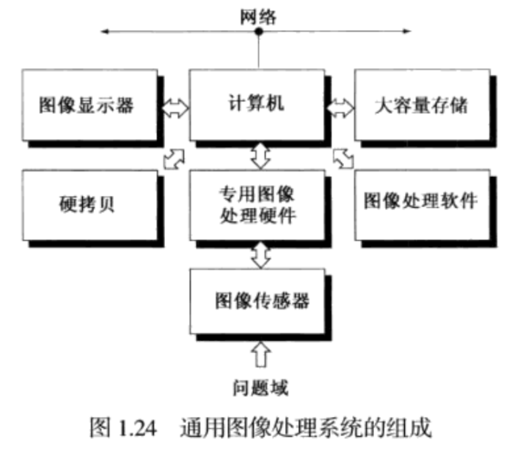
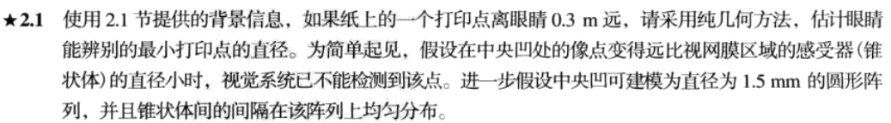
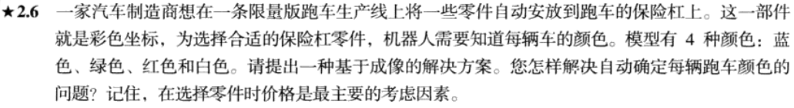
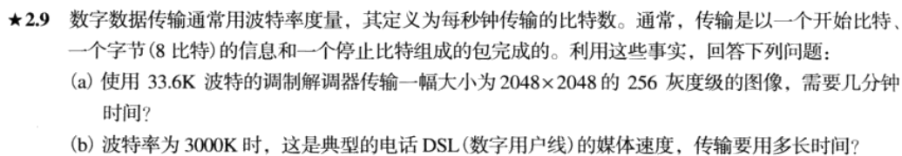
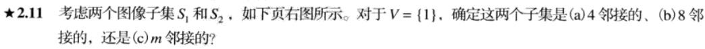
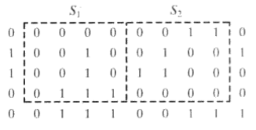
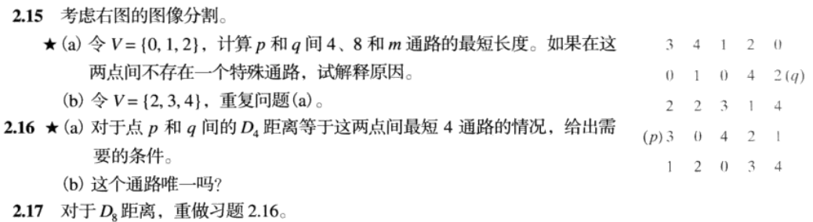

# DIP 01数字图像基础

> 数字图像相关概念，一些标记符号的介绍。

[TOC]

## 1视觉感知要素

1. 人的视觉系统能适应的光强度级别范围是很宽的。从夜视阈值到强闪光约有10^10^量级。

2. 人的视觉绝对不能同时在整个范围内工作，确切的说，它是利用改变其整个灵敏度来完成这一大变动的，即亮度适应现象。

3. 视觉系统对亮度的感知不是简单的强度函数。例如：马赫带现象、同时对比现象。

   

4. 人的感知系统有时会产生视觉错觉。

   

5. 人感受到的可见光的彩色范围占电磁波的一小部分。

   

## 2图像的获取、取样和量化

### 2.1图像的获取

1. 各类图像都是由“照射”源和形成图像的“场景”元素对光能的反射或吸收相结合而产生的。

2. “照射”

   1. 可能由电磁能源引起：雷达、红外线或X射线能源；
   2. 也可能由非传统光源引起：超声波、计算机产生的照射模式。

3. “场景”

   1. 可能是熟悉的物体；
   2. 也可能是分子、沉积岩或人类大脑，甚至是一个光源（如太阳）。

4. 图像传感器（点状、带状、阵列）

   

5. 简单的图像形成模型

   * 用二维函数形式$f(x,y)$表示图像，在特定坐标$(x,y)$处，$f$的值或幅度是一个正的标量，其物理意义由图像源决定。

   * 【物理上】当一幅图从物理过程产生时，它的值正比于物理源的辐射能量。因此，$f(x,y)$一定是非零且有限的：$0<f(x,y)<\infin$.

   * 函数可由两个分量来表征：

     1. 【入射分量】入射到观察场景的光源总量和。$i(x,y)$
     2. 【反射分量/透射分量】场景中物体反射光的总量。$r(x,y)$

     
     $$
     f(x,y)=i(x,y)r(x,y)\\
     0<i(x,y)<\infin,0<r(x,y)<1
     $$

### 2.2图像的取样和量化

1. 一幅连续图像的$x$和$y$坐标以及幅度可能都是连续的。为了转换为数字图像，必须在坐标与幅度上都做数字化操作。

   * 【取样】数字化坐标值。
   * 【量化】数字化幅度值。

2. 基本概念

   * 设连续图像为$f(x,y)$

   * 作**二维取样函数**
     $$
     S(x,y)=\sum^{+\infin}_{m=-\infin}\sum^{+\infin}_{n=-\infin}\delta(x-m\Delta x,\ y-n\Delta y)\\
     \delta(x, y) = \begin{cases}
     1, \quad x=y=0\\
     0, \quad others\\
     \end{cases}
     $$

   * 取样后的图像为
     $$
     \begin{align}
     f_s(x,y)&=S(x,y)f(x,y)\\
     &=\sum^{+\infin}_{m=-\infin}\sum^{+\infin}_{n=-\infin}f(x,y)\delta(x-m\Delta x,\ y-n\Delta y)\\
     &=\sum^{+\infin}_{m=-\infin}\sum^{+\infin}_{n=-\infin}f(m\Delta x,n\Delta y)\delta(x-m\Delta x,\ y-n\Delta y)
     \end{align}
     $$
     

## 3放大和收缩数字图像

* 近邻插值 / 双线性插值

   

## 4像素间的一些基本关系

* 相邻像素

  对像素$p(x, y)$:

  * 4邻域（N~4~(p) ）: p的上、下、左、右的点的集合。
  * N~D~(p)：p的四个对角相邻像素的集合。
  * 8邻域（N~8~(p)）：N~D~(p)与N~4~(p)共同组成。

* 邻接性、连通性、区域、边界

  * 灰度值的邻接性（值域V）

    > 例如，二值图象中，像素值都为1（或都为0）的像素才有可能被称为是邻接的。在一般图像中，可定义一个值域V，V是0到255中的一个子集。

  * 物理位置的邻接性（邻域，如N~4~(p)等）

  * 4邻接：如果点q在N~4~(p)中，并q和p具有V中的数值，则q和p是4邻接的。

  * 8邻接：如果点q在N~8~(p)中，并q和p具有V中的数值，则q和p是8邻接的。

  * m邻接（混合邻接）：满足下列条件的任一个，则具有V中数值的p和q是m连接的。

    * q在中N~4~(p)
    * q在N~D~(p)中，且集合N~4~(p)∩N~4~(q)中没有V值的像素。
  
* 距离度量

  对于点$p(x,y),q(s,t),z(v,w)$:

  * 欧氏距离

    $D_e(p,q)=\big[(x-s)^2+(y-t)^2\big]^\frac{1}{2}$

  * D~4~距离（城市街区距离）

    $D_4(p,q)=\big|x-s\big|+\big|y-t\big|$

  * D~8~距离（棋盘距离）

    $D_8(p,q)=max\big(|x-s|,\ |y-t|\big)$

## 5线性与非线性操作

令H为一个算子：
$$
H[f(x,y)] = g(x,y)\\
$$

其中，$f,g$代表图像。

若：
$$
H[a_1f_1(x,y) + a_2f_2(x,y)] = a_1H[f_1(x,y)]+a_2H[(f_2(x,y)]
$$
则称H是线性算子。

## 6数字图像处理的基本步骤方法、部件

---

## Exercise

> $\dfrac{d}{1.5mm/579} = \dfrac{0.3m}{17mm}$ >> $d<4.57\times 10^{-3}mm$

> 用摄像头记录其RGB值，若三者相等则为白色。

> (a) $T_a = \dfrac{2048^2\times10\ bits}{33.6K\ bits/s}\div60\ s/min = 20.8min$
>
> (b) $T_b = \dfrac{2048^2\times10\ bits}{3000K\ bits/s}\div60\ s/min = 0.233min$

> 因为S1中（3,3）坐标点p与S2中（0,2）坐标点q有：
>
> (a) 不是4邻接的，p不在q的N~4~中。
>
> (b) 是8邻接的。
>
> (c) 是m邻接的，因为p在q的N~D~中，且N~4~(p)∩N~4~(q)中元素不在V中。

> 2.16
>
> (a) $D_4(p,q) = 4+2=6$，要求路径上所有点都在V内。
>
> (b) 由V的内容决定。

// 2019/08/30