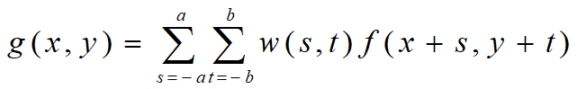

# DIP 02 图像增强-空间域滤波

> 图像增强是图像处理中最具吸引力的领域，目的是提高图像在特定应用领域的视觉质量。

[TOC]

## 1 概述

* 图像增强包括光滑、锐化、提取边缘、反转、去噪以及各种滤波等等处理。目的是经过处理后的图像更适合特定的应用（主要是主观的观察分析）。
* 没有通用的理论和方法，主观评价为主。
* 仍然有很多待解决的问题。
* 共有两大类算法：空间域和频率域。

## 2 空间域图像增强

> 直接对图像的像素进行操作。

### 2.1 基本关系式

$$
g(x,y)=T\big(f(x,y)\big)
$$

其中，

* $f(x,y)$ 为输入图像；
* $T$ 为算子，定义域是$(x,y)$的某个邻域；
* $T$ 可以对数个图像进行操作；
* 灰度变换：$(x,y)$的邻域为一个点时：$s=T(r)$

### 2.2 基本灰度变换

**预览：线性、对数、幂次 $s=T(r)$**

 

**反转变换 $s=L-1-r$**

> 人眼的一个特点就是在背景相对光亮时对灰度层次有较好的分辨能力。

####  2.2.1 对数变换

$$
s = clog(1+r)\\
c为常数，r\geq0
$$

* 适合大范围的数据压缩。
* 任何具有对数函数曲线形状的变换都可以完成灰度的**压缩和扩展**功能。 

#### 2.2.2 幂次变换

$$
s=Cr^\gamma\\
c,\gamma为常数
$$

* 当幂指数变化时，得到一系列不同的曲线，对应于不同效果的变换。这是和对数变换不同和方便的地方。

* 伽马校正

  > 大量的图像设备如捕捉卡、打印机、数码相机以及显示装置的响应（输出）就对应一个幂函数，通常称这个幂函数的指数为“伽玛”（gamma）。纠正这个幂次响应的处理称为伽玛校正（gamma correction）。阴极射线管（CRT）装置中有一个电压-强度响应，这个响应就是指数γ变换范围在1.8~2.5的幂函数。 

* 幂函数还可以用于调整图像对比度。
* 如果图像偏暗，有些低灰度值的细节被掩盖时，可考虑用指数$\gamma<1$的伽玛校正；反之，$\gamma>1$的校正对那些被“漂白”的细节会起作用。

### 2.3 图像直方图

#### 2.3.1 概述

* 灰度级别：$[0,L-1]$

* 数字图像直方图是离散函数$h(r_k)=n_k$，其中$r_k$是第$k$级灰度，$n_k$是图像中灰度级为$k$的像素个数。

* 如果用图像中的像素总数（用n来表示）除它的每一个值，就得到一个归一化的直方图：
  $$
  P(r_k)=\dfrac{n_k}{n}\\
  0\leq P(r_k)\leq1\\
  且\sum_k P(r_k)=1,k=0,1,...,L-1
  $$
  
* 灰度直方图表示数字图像中每一个灰度级与其出现频数的统计关系。

#### 2.3.2 直方图均衡化

* 图像视觉质量和图像直方图的关系

   四种基本图像类型：暗、亮、低对比度、高对比度

* 直方图是图像处理领域中的一个重要工具，也可以用于图像增强。从前面的分析可知，一般情况下若是图像的直方图成**均匀分布态势**，则图像的**对比度较高**且有比较**丰富的灰度色调**。这就为我们提供了一种基于直方图的图像增强处理方法。也就是说为了达到好的图像效果,可寻求一种变换：
  $$
  s =T (r),0\leq r\leq L-1
  $$
  使得变换后的图像具有（尽可能）均匀分布的直方图。

* 均衡化步骤：灰度级：$r_k$，变换函数：$s_k$，$k=0,1,2,...,L-1$

  1. 计算**概率**：$p_r(r_k)=\dfrac{n_k}{n}$
  2. 计算**累积分布函数**：$P(r_k)=\sum\limits^k_{j=0}p_r(r_j)=\sum\limits^k_{j=0}\dfrac{n_j}{n}$
  3. **变换函数**：$s_k=T(r_k)=(L-1)\times\sum\limits^k_{j=0}\dfrac{n_j}{n}$
  4. 将$s_k$ “四舍五入” 转换为标准灰度级别，如果有相同的$\lceil s_k\rceil$，则合并。

* 直方图均衡化方法用于图像增强有一个最大的特点：自动化，有强大的适应性强的功能。

#### 2.3.4 直方图匹配 - 灰度对齐

> 两幅图像比对前，通常要使其直方图一致。

* 基本方法（利用连续情形推导离散数据的近似公式）

  由图A >>> 图C

  1. $s=T(r)=(L-1)\int_0^rp_r(w)\ dw$

  2. $s=G(z)=(L-1)\int_0^zp_z(t)\ dt$

  3. 理论变换公式：

     $z=G^{-1}(s)=G^{-1}T(r)$

* 离散图像数据的近似公式

  1. 计算原图直方图
  2. 给出输出图像期望的直方图
  3. 得到离散情形的变换公式

#### 2.3.5 直方图统计

* 图像灰度平均值
  $$
  p(r_i)=\dfrac{n_i}{n},i=0,1,2,...,L-1\\
  m =\sum\limits_{i=0}^{L-1}r_ip(r_i)
  $$

* 方差（n阶矩）
  $$
  \mu_n(r)=\sum\limits_{i=0}^{L-1}(r_i-m)^np(r_i)
  $$
  即为n阶矩，n = 2时为方差。

### 2.4 空间滤波基础

#### 2.4.1 空间滤波机理

* **滤波**的概念来自信号处理中的傅里叶变换

* 空间滤波指的是直接对图像像素进行处理的操作

* 大致分为线性和非线性两种情形

* 对像素灰度值的调整要利用该像素周围的像素信息

* 滤波器（filter）的概念。

  滤波器有时也叫掩模（mask）、核（kernel）、模板（template）或窗口（window）

* 空间域线性滤波的基本公式

  
  
* MxN的滤波器$w(x,y)$与图像$f(x,y)$相关操作定义为：
  $$
  w(x,y)\cdot f(x,y) = \sum\limits_{s=-a}^a \sum\limits_{t=-b}^b w(s,t)f(x+s,y+t)
  $$

* MxN的滤波器$w(x,y)$与图像$f(x,y)$卷积定义为：
  $$
  w(x,y)* f(x,y) = \sum\limits_{s=-a}^a \sum\limits_{t=-b}^b w(s,t)f(x-s,y-t)
  $$

#### 2.4.2 平滑空间滤波器

* 平滑的主要作用是去除小的细节（噪声）提取大的目标，来得到感兴趣物体的一个大致描述。

* 平滑滤波器分线性和非线性两种。

* 一般公式（**均值滤波**）
  $$
  w(x,y)\cdot f(x,y) = \dfrac{\sum\limits_{s=-a}^a \sum\limits_{t=-b}^b w(s,t)f(x+s,y+t)}{\sum\limits_{s=-a}^a \sum\limits_{t=-b}^b w(s,t)}
  $$

#### 2.4.3 统计排序（非线性）滤波器

* 排序统计滤波器是一种非线性的、非卷积滤波器。
* 排序统计滤波器在滤波器包围的像素范围内排序，然后由统计排序结果决定的值代替中心像素的值。按排序输出的位置分，可分为：中值滤波、最大值滤波、最小值滤波。
* 中值滤波：类似均值线性滤波器用于去噪，但中值滤波器在衰减噪声的同时不使边界模糊。
  * 将数字图象上每个点的值用该点的一个邻域中各点值的中值代替。
* 中值 >>> 第50%百分点的滤波器，同理，可以构造第X百分点滤波器：
  * X < 50 趋向于图像变暗
  * X > 50 趋向于图像变亮

#### 2.4.4 空间锐化滤波器

* 锐化的目的和平滑相反，是为了**突出**图像中的**细节**或者**增强被模糊了的细节**。

* 对图像像素邻域作线性平均（求和、积分），可以得到光滑图像的效果。那么可以想象如果用“求差、微分”的方法，应该得到相反的结果。直观上看也是如此。

* 一维下：因为数字图像中像素点是离散的，用离散数据差分来替代微分

  * 一阶微分
    $$
    \dfrac{\partial f}{\partial x} = f(x+1)-f(x)
    $$
  
* 二阶微分
    $$
    \dfrac{\partial^2 f}{\partial x^2} = f(x+1)+f(x-1)-2f(x)
    $$
  
* 结论

  * 一阶微分产生较“宽”的边界，二阶微分产生较“细”的边界；
  * 二阶微分处理对细节有较强的响应，如细线和孤立点；
  * 一阶微分对阶梯状的灰度变化有较强的响应；
  * 二阶微分在处理阶梯状灰度变化时产生双响应；
  * 如果灰度的变化相似，二阶微分对线的反应比对阶梯强，对点的反应比对线强。

### 2.4.5 拉普拉斯算子

对连续函数情形，最简单且各向同性的二阶微分算子是拉普拉斯（Laplacian）算子。

即$\nabla^{2} f=\dfrac{\partial^{2} f}{\partial x^{2}}+\dfrac{\partial^{2} f}{\partial y^{2}}$

离散情况下：
$$
\begin{array}{c}{\dfrac{\partial^{2} f}{\partial x^{2}}=f(x+1, y)+f(x-1, y)-2 f(x, y)} \\ {\dfrac{\partial^{2} f}{\partial y^{2}}=f(x, y+1)+f(x, y-1)-2 f(x, y)} \\ {\nabla^{2} f=[f(x+1, y)+f(x-1, y)+f(x, y+1)+f(x, y-1)]-4 f(x,y)}\end{array}
$$
​	其实直接从滤波器的表示也可以直观看出这种滤波对**图像的突变**有比较强的响应（即在突变的位置有较大的输出值），对灰度变化缓慢的区域滤波响应的值会变得很小（变暗）。

​	因此，用拉普拉斯算子作用后，产生的图像将是在暗背景上的一些灰色边线和一些突变点。若将**原始图像叠加到拉普拉斯变换后的图像**，既可以保护拉普拉斯锐化处理的效果，同时又能复原背景信息。

* **基本方法** 

$$
g(x, y)=\left\{\begin{array}{l}{f(x, y)-\nabla^{2} f，当中心系数为负} \\ {f(x, y)+\nabla^{2} f，当中心系数为正}\end{array}\right.
$$

* **标定**

  * 经由拉普拉斯锐化后的图像中既有正值又有负值，且所有负值在显示时转换为0，导致图像大部分都是**黑色**。

  * 采用标定的方法，将结果标定到整个灰度范围中。
    $$
    g(x,y)=f(x,y)+c\big[\nabla^2f(x,y)\big]
    $$

### 2.4.6 非锐化掩模和高提升滤波

* 非锐化掩模（Unsharp Masking）

  * 把原图的一个模糊过的图像从原图中减去，从而得到一个相对清晰的图像（就象一个模糊的负片和一个正片放在一起冲洗出相对清晰的照片）。
    $$
    f_{S}(x, y)=f(x, y)-\overline{f}(x, y)
    $$
    更普遍形式就是所谓的高提升滤波处理.

* 高提升滤波（high-boosting filtering）

  * 一般形式
    $$
    f_{h b}(x, y)=A f(x, y)-\overline{f}(x, y)
    $$
  
* 其中A≥1，目的是提升原图的亮度。上式还可以等价写成：
    $$
    f_{h b}(x, y)=(A-1) f(x, y)+f_{s}(x, y)
    $$
  
* 前一部分“调整”了原图的灰度，后一部分是锐化过的图像。 
  
* 基于拉普拉斯算子的高提升滤波
  $$
  f_{hb}(x, y)=\left\{\begin{array}{l}{Af(x, y)-\nabla^{2} f，当中心系数为负} \\ {Af(x, y)+\nabla^{2} f，当中心系数为正}\end{array}\right.
  $$

  * 当A=1，退化为拉普拉斯方法。

### 2.4.7 梯度

* 梯度是基于一阶微分的图像增强。

* 一阶微分在灰度的跳跃性间断处（边界处）有较强的响应，所以在一些情况下也可以用于图像增强。图像情形考虑二维函数的梯度。
  $$
  \nabla \mathbf{f}=\left[G_{x}, G_{y}\right]=\left[\frac{\partial f}{\partial x}, \frac{\partial f}{\partial y}\right]
  $$

* 模：用图像显示二维函数的梯度，通常在不引起混淆的情况下，**把梯度的模称为梯度。**

  * L~2~模
    $$
    \nabla f=\left[G_{x}^{2}+G_{y}^{2}\right]^{1 / 2}=\left[\left(\frac{\partial f}{\partial x}\right)^{2}+\left(\frac{\partial f}{\partial y}\right)^{2}\right]^{1 / 2}
    $$
    L2模具有各向同性的性质，但计算不方便。

    为了克服计算复杂的困难，在某些情况下，用*L*1模可以减少计算量，并且不影响结果。

  * L~1~模
    $$
    \nabla f \approx\left|G_{x}\right|+\left|G_{y}\right|
    $$

* 离散图像数据的梯度计算

  * Robert交叉梯度算子
    $$
    G_{x}=\left(z_{9}-z_{5}\right), G_{y}=\left(z_{8}-z_{6}\right)\\
    \nabla f=\left|z_{9}-z_{5}\right|+\left|z_{8}-z_{6}\right|
    $$

  * Sobel算子
    $$
    \nabla f=\big|\left(z_{7}+2 z_{8}+z_{3}\right)-\left(z_{1}+2 z_{2}+z_{3}\right)\big|+\big|\left(z_{3}+2 z_{6}+z_{9}\right)-\left(z_{1}+2 z_{4}+z_{7}\right)\big|
    $$

## 3 Assignment

1. 做出一个图像的直方图，将之均衡化。
2. 做一个gamma变化，把一个暗的图像变亮、或将亮的图像变暗。 

