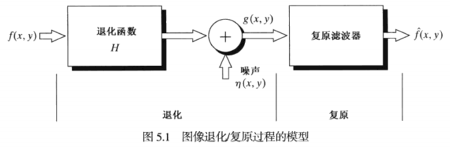
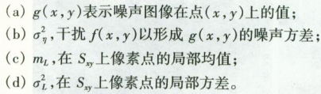
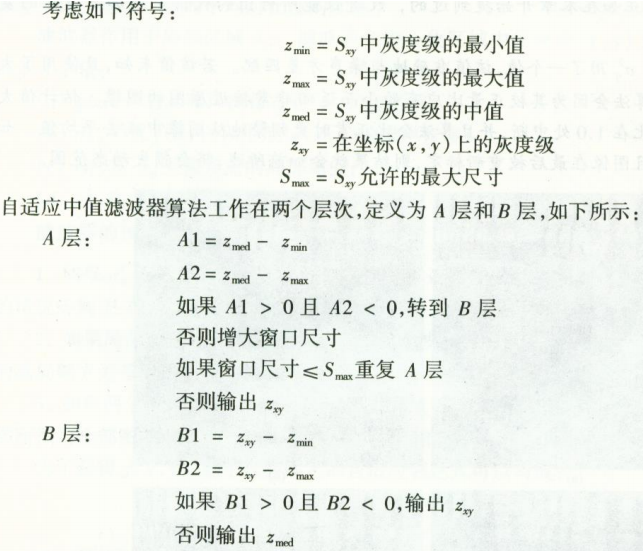

# DIP 04 图像复原

> 图像复原是利用退化现象的某种先验知识来重建被退化的图像,是一个客观的过程。
>
> 图像增强是为了人类视觉系统的生理接受特点而设计的一种改善图像的方法,是一个主观的过程。

[toc]

##1 退化与复原过程模型

* 空间域
  $$
  g(x, y)=h(x, y) * f(x, y)+\eta(x, y)
  $$

* 频率域
  $$
  G(u, v)=H(u, v) F(u, v)+N(u, v)
  $$

## 2 噪声模型

* 噪声来自光照强度、传感器温度和灰尘等。

* 当噪声的Fourier谱是常量时，该噪声成为白噪声。

* 通常把噪声看作来自某个样本集的随机变量。该随机变量可以由其概率密度函数（PDF）刻画。

* 噪声模型：

  高斯噪声、瑞利噪声、伽马噪声、指数分布噪声、均匀分布噪声、脉冲（椒盐）噪声。

### 2.1 高斯噪声

$$
p(z)=\frac{1}{\sqrt{2 \pi} \sigma} e^{-(z-\mu)^{2} / 2 \sigma^{2}}
$$

* z为灰度值。
* 其值有70%落在$[(\mu-\sigma),(\mu+\sigma)]$
* 有95%落在$[(\mu-2\sigma),(\mu+2\sigma)]$

### 2.2 椒盐噪声

$$
p(z)=\left\{\begin{array}{ll}{P_{a}} & {z=a} \\ {P_{b}} & {z=b} \\ {0} & {others}\end{array}\right.
$$

* 假设 b > a，则b和a分别表示一个亮点和一个暗点（通常是最大和最小灰度值）

### 2.3 瑞利噪声

$$
p(z)=\left\{\begin{array}{ll}{\frac{2}{b}(z-a) \mathrm{e}^{-(z-a)^{2} / b}} & {z \geqslant a} \\ {0} & {z<a}\end{array}\right.
$$

其中，
$$
\mu=a+\sqrt{\pi b / 4}\\
\sigma^{2}=\frac{b(4-\pi)}{4}
$$

### 2.4 伽马（爱尔兰）噪声

$$
p(z)=\left\{\begin{array}{ll}{\frac{a^{b} z^{b-1}}{(b-1) !} \mathrm{e}^{-a x}} & {z \geqslant 0} \\ {0} & {z<0}\end{array}\right.
$$

其中，
$$
\mu=\frac{b}{a}\\
\sigma^{2}=\frac{b}{a^{2}}
$$

### 2.5 指数分布噪声

$$
p(z)=\left\{\begin{array}{ll}{a \mathrm{e}^{-a x}} & {z \geqslant 0} \\ {0} & {z<0}\end{array}\right.
$$

$$
\mu=\frac{1}{a}\\
\sigma^{2}=\frac{1}{a^{2}}
$$

## 3 只存在噪声时的空间滤波复原

只存在噪声时，退化模型：
$$
g(x, y)=f(x, y)+\eta(x, y)\\
G(u, v)=F(u, v)+N(u, v)
$$

### 3.1 均值滤波器

* 算术均值滤波器：$\hat{f}(x, y)=\frac{1}{m n} \sum\limits_{(s, t) \in S_{xy}} g(s, t)$
* 几何均值滤波器：$\hat{f}(x, y)=\left[\prod\limits_{(s, t) \in S_{xy}} g(s, t)\right]^{\frac{1}{m n}}$
* 谐波均值滤波器：$\hat{f}(x, y)=\dfrac{m n}{\sum_{(s, t) \in S_{x y}} \frac{1}{g(s, t)}}$
* 逆谐波均值滤波器：$\hat{f}(x, y)=\dfrac{\sum\limits_{(s, t) \in S_{x y}} g(s, t)^{Q+1}}{\sum\limits_{(s, t) \in S_{x y}} g(s, t)^{Q}}$

结论：

* 几何均值滤波器与算术均值滤波器相比，更少模糊细节。
* 谐波均值滤波器对”盐”噪声效果好，而不适应”胡椒”噪声。
* 逆谐波均值滤波器：
  * 当Q为正时，用于消除”胡椒”噪声；
  * 当Q为负时，用于消除”盐”噪声；
  * 当Q=0时，退化为算术均值滤波器；
  * 当Q=-1时，退化为谐波均值滤波器。

### 3.2 顺序统计滤波器

* 最大滤波器：$\hat{f}(x, y)=\max _{(s, y) \in S_{x y}}\{g(s, t)\}$

* 最小滤波器：$\hat{f}(x, y)=\min _{(s, y) \in S_{x y}}\{g(s, t)\}$

* 中点滤波器：$\hat{f}(x, y)=\frac{1}{2}\left[\max _{(s, y) \in S_{y}}\{g(s, t)\}+\min _{(s, y) \in S_{y}}\{g(s, t)\}\right]$

* 修正后的阿尔法均值滤波器：$\hat{f}(x, y)=\frac{1}{m n-d} \sum_{(s, y) \in S_{x y}} g_{r}(s, t)$

  其中，g~r~(s, t)表示去除灰度值最高和最低的d/2个像素之后，剩下的mn-d个像素。

### 3.3 自适应滤波器

**自适应去噪滤波器**

分析滤波器：

* 滤波器作用于局部区域S~xy~；

* 在中心化区域中任何点上的滤波器相应基于：

   

* 噪声方差为0，滤波器应该直接返回g(x, y)。

* 若两个方差高相关，应该返回一个g(x, y)的近似值。

* 若两个方差相等，希望滤波器返回区域S~xy~上的算术均值。

综上，可将其定义为
$$
\hat{f}(x, y)=g(x, y)-\frac{\sigma_{\eta}^{2}}{\sigma_{L}^{2}}\left[g(x, y)-m_{L}\right]
$$
**自适应中值滤波器**

自适应中值滤波器的处理有三个目的：**除去“椒盐”噪声**，**平滑其他非椒盐噪声**，并**减少诸如物体边界细化或粗化的失真**。

> 自适应中值滤波器对**噪声密度大**时更有效，并且平滑非冲激噪声时可以保存细节。

 

## 4 频域滤波抑制噪声

### 4.1 二维带阻滤波器H~br~

**理想带阻滤波器**
$$
H(u, v)=\left\{\begin{array}{ll}{1,} & {D(u, v)<D_{0}-\frac{W}{2}} \\ {0, D_{0}-\frac{W}{2} \leq D(u, v) \leq D_{0}} & {+\frac{W}{2}} \\ {1,} & {D(u, v)>D_{0}+\frac{W}{2}}\end{array}\right.
$$
其中，D~0~为频谱中心半径，W为频带宽度。

**二维n阶巴特沃斯带阻滤波器**
$$
H(u, v)=\frac{1}{1+\left[\frac{D(u, v) W}{D^{2}(u, v)-D_{0}^{2}}\right]^{2 n}}
$$
**二维高斯带阻滤波器**
$$
H(u, v)=1-e^{-\frac{1}{2}\left[\frac{D(u, v) W}{D^{2}(u, v)-D_{0}^{2}}\right]^{2}}
$$

### 4.2 二维带通滤波器H~bp~

类似高通/低通，二维带通滤波器也可以通过二维带阻滤波器来构造。
$$
H_{b p}(u, v)=1-H_{b r}(u, v)
$$

### 4.3 陷波滤波器

* 陷波滤波器阻止(或通过)事先定义的中心频率邻域内的频率；
* 陷波滤波器分**陷波带阻滤波器**和**陷波带通滤波器**两大类；
* 陷波带阻滤波器又分为理想\巴特沃斯\高斯陷波带阻滤波器等；
* 陷波带通滤波器又分为理想\巴特沃斯\高斯陷波带通滤波器等。

**陷波带阻滤波器H~nr~**

**理想陷波带阻滤波器传递函数**
$$
H(u, v)=\left\{\begin{array}{ll}{0} & {D_{1}(u, v) \leq D_{0} \ ||\  \mathcal{D}_{2}(u, v) \leq D_{0}} \\ {1} & {others}\end{array}\right.
$$
其中，D~0~为半径，(u~0~, v~0~)为中心。

且：
$$
\begin{array}{l}{D_{1}(u, v)=\left[\left(u-M / 2-u_{0}\right)^{2}+\left(v-N / 2-v_{0}\right)^{2}\right]^{1 / 2}} \\ {D_{2}(u, v)=\left[\left(u-M / 2+u_{0}\right)^{2}+\left(v-N / 2+v_{0}\right)^{2}\right]^{1 / 2}}\end{array}
$$
**n阶巴特沃斯陷波带阻滤波器传递函数**
$$
H(u, v)=\frac{1}{1+\left[\frac{D_{0}^{2}}{D_{1}(u, v) D_{2}(u, v)}\right]^{n}}
$$
其中，D~0~为半径，(u~0~, v~0~)为中心。

D~1~, D~2~ 同上。

**高斯陷波带阻滤波器传递函数**
$$
H(u, v)=1-e^{-\frac{1}{2}\left[\frac{D_{1}(u, v) D_{2}(u, v)}{D_{0}^{2}}\right]}
$$
其中，D~0~为半径，(u~0~, v~0~)为中心。

D~1~, D~2~ 同上。

**陷波带通滤波器传递函数H~np~**

类似的，
$$
H_{n p}(u, v)=1-H_{n r}(u, v)
$$

### 4.4 最佳陷波滤波器

当 G(u, v) 存在几种干扰时,可以采用下面的方法:
1. 提取干扰模式的主频率成分，对每个尖峰点，设计一个陷波带通滤波器 H(u, v)；

  因此, $N(u, v)=H(u, v) G(u, v)$

  或 $\eta(x, y)=\boldsymbol{F}^{-1}\{H(u, v) G(u, v)\}$

2. 去除噪声：
  $$
  \hat{f}(x, y)=g(x, y)-w(x, y) \eta(x, y)
  $$
  其中，$w(x, y)$为调制函数。

3. 关于$w(x, y)$：

   选取$w(x, y)$，使估计值 $\hat{f}(x, y)$每一点$(x, y)$指定的邻域上**方差最小**。

   考虑尺寸为$(2 a+1) \times(2 b+1)$的邻域：

   $\hat{f}(x, y)$的局部方差为：
   $$
   \sigma^{2}(x, y)=\frac{1}{(2 a+1)(2 b+1)} \sum_{s=-a t=-b}^{a} \sum_{a=-b}^{b}[\hat{f}(x+s, y+t)-\small\overline{\hat{f}}(x, y)]^{2}
   $$
   其中$\small\overline{\hat{f}}(x, y)$是$\hat{f}(x, y)$在其邻域内的均值。
   $$
   \overline{\hat{f}}(x, y)=\frac{1}{(2 a+1)(2 b+1)} \sum_{s=-a t=-b}^{a} \hat{f}(x+s, y+t)
   $$

4. 假设$w(x, y)$在整个邻域内不变，当$-a \leq s \leq a$且$-b \leq s \leq b$时，

   由近似定义：$w(x+s, y+t)=w(x, y)$

   这一假设也可以在邻域内得出如下表达式：$w(x, y) \eta(x, y)=w(x, y) \bar{\eta}(x, y)$

5. 由该假设：

   原方差：
   $$
   \begin{aligned} \sigma^{2}(x, y)=& \frac{1}{(2 a+1)(2 b+1)} \sum_{s=-a}^{a}\sum_{t=-b}^{b}\{[g(x+s, y+t)\\ &-w(x+s, y+t) \eta(x+s, y+t)] \\ &-[\bar{g}(x, y)- \overline{w(x, y) \eta(x, y)}]\}^{2} \end{aligned}
   $$
   变换后方差：
   $$
   \begin{aligned} \sigma^{2}(x, y)=& \frac{1}{(2 a+1)(2 b+1)} \sum_{s=-a}^{a}\sum_{t=-b}^{b}\{[g(x+s, y+t)-w(x, y) \eta(x, y)]\\ &-[\bar{g}(x, y)-w(x, y) \bar{\eta}(x, y)]\}^{2} \end{aligned}
   $$

6. 将方差最小化，即求解：
   $$
   \frac{\partial \sigma^{2}(x, y)}{\partial w(x, y)}=0
   $$
   解得：
   $$
   w(x, y)=\frac{\overline{g(x, y) \eta(x, y)}-\bar{g}(x, y) \bar{\eta}(x, y)}{\overline{\eta^{2}}(x, y)-\bar{\eta}^{2}(x, y)}
   $$

## 5 线性、移不变的退化

## 6 估计退化函数

## 7 逆滤波

## 8 最小均方误差绿波（维纳去卷积）

## 9 约束最小二乘方滤波器

## 10 几何均值滤波

## 11 维纳滤波器(Wiener filter)设计

$$
H(u, v)=1-e^{-\frac{1}{2}\left[\frac{D(u, v) W}{D^{2}(u, v)-D_{0}^{2}}\right]^{2}}
$$
