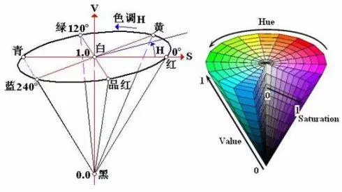

# 颜色空间

> 颜色空间  =  色彩空间

[toc]

## 1 RGB 空间

- 主要用于老的显示系统，R，G，B三原色混合产生各种颜色.扫描仪也是通过吸收原稿经反射或者投射的光线的R，G，B部分来还原原稿的颜色.

- RGB色彩空间是设备相关的，即不同的显示器显示同一图像，有不同的色彩显示结果，不同的扫描仪扫描相同的图像，也会得到不同的图像数据.

- 其中，R = G = B = 0表示黑;R = B = G = 255表示白.

    

  

- RGB空间的缺点
  - RGB颜色空间利用三个颜色分量的线性组合来表示颜色，因此不同的色彩难以用精确的数值来表示，定量分析困难.例如海棠红，银河灰，难以有一个直观的表达
  - 在RGB颜色系统中，三个颜色分量是亮度相关的，即只要亮度改变，三个分量都会改变，如果一个颜色的某一个分量发生了一定程度的改变，那么这颜色也可能要发生改变.例如如果要在某一颜色的基础上增加一点亮度，则需要依次改变RGB的值，而没有一种更直观的方式来表达.
  - RGB颜色空间是一种均匀性较差的颜色空间，人眼对于三种颜色分量的敏感程度是不一样的， 在单色中，人眼对红色最不敏感，蓝色最敏感.如果颜色的相似性直接用欧氏距离来度量，其结果与人眼视觉会有较大的偏差.

### 2，HSV空间

**HSV分别代表hue，saturation，value 色相，饱和度，明度**
HSV以人类更熟悉的方式封装了关于颜色的信息"这是什么颜色？深浅如何？明暗如何？"

 

其表示方式由上图圆柱体所示:

- V轴表示明度，范围是0~1，与光强度无直接关系。
- V方向最下面为0，表示黑，最上面圆心为1，表示白。
- H方向表示色度，分别为红绿蓝，相隔120度。
- S方向表示饱和度，位于外圆周的颜色饱和度越高，越靠近圆心饱和度越低
- S是一个比例值，表示所选颜色纯度与最大的纯度之间的比例。当S = 0时，表示灰度。

一般的，人的眼睛最大能区分128种色彩，130种饱和度和23种明暗度。若仅使用16bits表示HSV值的话，可用7位存放H，4位存放S，5位存放V，即H7S4V5或者H6S5V5就能满足需求。

HSV模式与RGB模型的相互转换关系这里不详细展开.

### 3，HSL颜色空间

**HSV分别代表hue，saturation，lightness 色相，饱和度，亮度**

HSL 类似于 HSV。对于一些人，HSL 更好的反映了“饱和度”和“亮度”作为两个独立参数的直觉观念，但是对于另一些人，它的饱和度定义是错误的，因为非常柔和的几乎白色的颜色在 HSL 可以被定义为是完全饱和的。对于 HSV 还是 HSL 更适合于人类用户界面是有争议的。

HSL的有点在于它对称于亮和暗，这意味着:

- 在 HSL 中，饱和度分量总是从完全饱和色变化到等价的灰色(在 HSV 中，在极大值 V 的时候，饱和度从全饱和色变化到白色，这可以被认为是反直觉的).
- 在 HSL 中，亮度跨越从黑色过选择的色相到白色的完整范围(在 HSV 中，V 分量只走一半行程，从黑到选择的色相).

### 4，YUV色彩空间

**YUV  =  YCrCb**
YUV是被欧洲电视系统所采用的一种颜色编码方法.
采用YUV色彩空间的重要性是它的亮度信号Y和色度信号U，V是分离的.如果只有Y信号分量而没有U，V信号分量，那么这样表示的图像就是黑白灰度图像.彩色电视采用YUV空间正是为了用亮度信号Y解决彩色电视机与黑白电视机的相容问题，使黑白电视机也能接收彩色电视信号.

YUV主要用于优化彩色视频信号的传输，使其向后相容老式黑白电视.与RGB视频信号传输相比，它最大的优点在于只需占用极少的频宽(RGB要求三个独立的视频信号同时传输).其中“Y”表示明亮度(Luminance或Luma)，也就是灰阶值;而“U”和“V” 表示的则是色度(Chrominance或Chroma)，作用是描述影像色彩及饱和度，用于指定像素的颜色.“亮度”是透过RGB输入信号来建立的，方法是将RGB信号的特定部分叠加到一起.“色度”则定义了颜色的两个方面─色调与饱和度，分别用Cr和CB来表示.其中，Cr反映了GB输入信号红色部分与RGB信号亮度值之间的差异.而CB反映的是RGB输入信号蓝色部分与RGB信号亮度值之同的差异.

采用YUV色彩空间的重要性是它的亮度信号Y和色度信号U，V是分离的.如果只有Y信号分量而没有U，V分量，那么这样表示的图像就是黑白灰度图像.彩色电视采用YUV空间正是为了用亮度信号Y解决彩色电视机与黑白电视机的兼容问题，使黑白电视机也能接收彩色电视信号.

---

2019/10 Karl